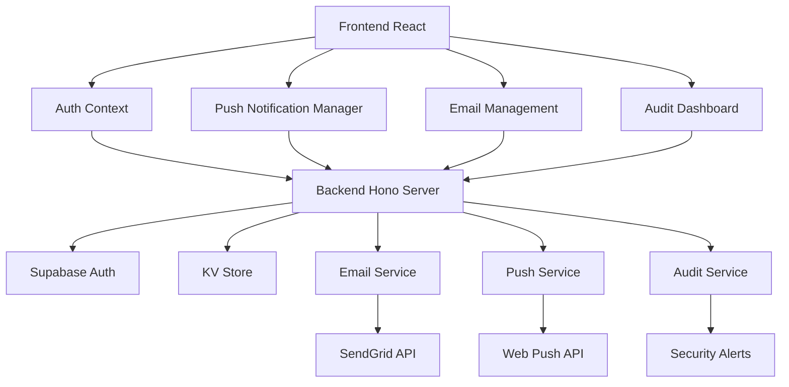

# 🚀 Funcionalidades Avançadas Implementadas

## ✅ Implementação Completa Realizada

### 📧 **Serviço Real de Email (SendGrid)**
- **Integração Nativa**: Substituiu simulação por envios reais via SendGrid API
- **Fallback Inteligente**: Simula envios quando API key não está configurada
- **Templates HTML**: Emails profissionais com design responsivo
- **Tracking Completo**: Logs detalhados de entrega, falhas e estatísticas
- **Configuração Simples**: Uma única variável de ambiente `SENDGRID_API_KEY`

#### Como Configurar:
```bash
1. Crie conta no SendGrid
2. Gere API Key no dashboard
3. Configure no ambiente: SENDGRID_API_KEY=SG.xxx
4. Teste via interface admin
```

### 🔔 **Notificações Push em Tempo Real**
- **Web Push API**: Notificações nativas do navegador
- **Service Worker**: Funciona mesmo com app fechado
- **VAPID Keys**: Autenticação segura para push notifications
- **Targeting Avançado**: Envio por usuário específico, role ou broadcast
- **Ações Personalizadas**: Botões nas notificações para ações rápidas

#### Funcionalidades:
- ✅ Registro automático de subscription
- ✅ Notificações com ícones e badges personalizados
- ✅ Suporte offline via Service Worker
- ✅ Analytics de entrega e falhas
- ✅ Interface de gerenciamento completa

### 🛡️ **Sistema de Auditoria e Segurança**
- **Logs Detalhados**: Rastreia todas as ações importantes do sistema
- **Alertas Automáticos**: Detecta atividades suspeitas e falhas de segurança
- **Dashboard Completo**: Interface visual para monitoramento
- **Resolução de Alertas**: Workflow para gerenciar incidentes
- **Relatórios**: Estatísticas e análises de segurança

#### Tipos de Logs:
```typescript
- user_login / user_logout
- user_created / user_updated
- password_reset_requested
- presentation_created / status_changed
- audience_created / status_changed
- meeting_scheduled / cancelled
- email_sent / push_notification_sent
- unauthorized_access_attempt
- settings_changed
```

#### Alertas de Segurança:
```typescript
- failed_login_attempts (5+ em 15 min)
- unauthorized_access
- suspicious_activity
- data_breach
- system_error
```

## 🏗️ **Nova Arquitetura dos Serviços**



## 📱 **Interface Administrativa Expandida**

### 🎛️ **Dashboard de Email**
- Estatísticas em tempo real (enviados, falharam, taxa de sucesso)
- Teste de configuração SendGrid
- Histórico detalhado de emails
- Gráficos por dia e status

### 🔔 **Central de Notificações Push**
- Ativação de notificações com um clique
- Envio para grupos específicos (Admin, Atendente, Usuário)
- Broadcast para todos os usuários
- Estatísticas de subscription e entrega

### 🛡️ **Dashboard de Auditoria**
- Logs filtráveis por ação, nível e usuário
- Alertas de segurança com severidade
- Resolução de incidentes
- Análises e tendências de segurança

## 🔧 **Configuração Completa**

### Variáveis de Ambiente:
```env
# Supabase (já configurado)
SUPABASE_URL=https://xxx.supabase.co
SUPABASE_ANON_KEY=eyJxxx...
SUPABASE_SERVICE_ROLE_KEY=eyJxxx...

# SendGrid (novo)
SENDGRID_API_KEY=SG.xxx

# VAPID Keys (opcionais - geradas automaticamente)
VAPID_PUBLIC_KEY=BN4GvZxxx...
VAPID_PRIVATE_KEY=example-private-key...

# Frontend URL (para redirects)
FRONTEND_URL=http://localhost:3000
```

### Novos Endpoints da API:

#### Email Service:
```typescript
POST /email/test              // Testar configuração SendGrid
GET  /email/stats             // Estatísticas de email
```

#### Push Notifications:
```typescript
POST /push/subscribe          // Registrar subscription
GET  /push/vapid-key         // Obter chave pública VAPID
POST /push/send-to-user      // Enviar para usuário específico
POST /push/send-to-role      // Enviar para role específica
POST /push/broadcast         // Broadcast para todos
GET  /push/stats             // Estatísticas de push
```

#### Auditoria & Segurança:
```typescript
GET  /audit/logs             // Buscar logs (filtros opcionais)
GET  /audit/alerts           // Buscar alertas de segurança
POST /audit/alerts/:id/resolve // Resolver alerta
GET  /audit/stats            // Estatísticas de auditoria
```

## 🎯 **Funcionalidades por Tipo de Usuário**

### 👑 **Administrador**
- ✅ Gerenciamento completo de email (SendGrid)
- ✅ Dashboard de auditoria e segurança
- ✅ Envio de notificações push
- ✅ Resolução de alertas de segurança
- ✅ Criação de usuários
- ✅ Acesso a todos os logs e estatísticas

### 👥 **Atendente**
- ✅ Notificações push para novos pedidos
- ✅ Alerts quando mudanças importantes acontecem
- ✅ Interface básica de notificações

### 👤 **Usuário**
- ✅ Notificações push quando status muda
- ✅ Alerts de reuniões agendadas
- ✅ Opção de ativar/desativar notificações

## 🚀 **Novos Fluxos Automáticos**

### 📧 **Fluxo de Email Aprimorado:**
1. **Criação da Notificação** → Sistema cria template HTML
2. **Queue de Envio** → Notificação fica pendente
3. **Processamento Real** → SendGrid API ou simulação
4. **Tracking** → Status atualizado (sent/failed)
5. **Auditoria** → Log completo do processo
6. **Estatísticas** → Dashboard atualizado

### 🔔 **Fluxo de Push Notification:**
1. **Registro** → Usuário ativa notificações
2. **Subscription** → Service Worker registrado
3. **Trigger** → Evento dispara notificação
4. **Targeting** → Filtra por usuário/role
5. **Entrega** → Web Push API envia
6. **Feedback** → Analytics de entrega

### 🛡️ **Fluxo de Auditoria:**
1. **Ação do Usuário** → Qualquer operação importante
2. **Log Automático** → Dados salvos com contexto
3. **Análise de Padrões** → Detecta atividades suspeitas
4. **Geração de Alertas** → Cria alertas automáticos
5. **Notificação** → Admin recebe notificação crítica
6. **Resolução** → Admin resolve e documenta

## 📊 **Métricas e Analytics**

### Email Analytics:
- 📈 Taxa de entrega por dia
- 📊 Distribuição por tipo de notificação
- ⚡ Tempo médio de processamento
- 🎯 Taxa de sucesso por destinatário

### Push Analytics:
- 👥 Número de subscriptions ativas
- 📱 Taxa de entrega por plataforma
- 🔔 Interação com notificações
- 📊 Efetividade por tipo de mensagem

### Security Analytics:
- 🔒 Tentativas de login por dia
- ⚠️ Alertas gerados por severidade
- 🕐 Tempo médio de resolução
- 📊 Padrões de atividade suspeita

## 🎨 **Interface Modernizada**

### Design System:
- 🎨 Ícones consistentes (Lucide React)
- 🏷️ Badges coloridos por status/severidade
- 📊 Cards informativos com métricas
- 🎯 Botões de ação contextuais

### UX Melhorada:
- ⚡ Feedback imediato com toasts
- 🔄 Atualizações automáticas
- 📱 Interface responsiva
- 🎯 Navegação intuitiva

## 🔮 **Roadmap de Melhorias Futuras**

### 📧 **Email Service Evolution:**
- [ ] Templates customizáveis via interface
- [ ] A/B testing para emails
- [ ] Webhook para tracking avançado
- [ ] Integração com outros provedores (Mailgun, AWS SES)

### 🔔 **Push Notifications Plus:**
- [ ] Notificações agendadas
- [ ] Rich notifications com imagens
- [ ] Geolocalização para notificações contextuais
- [ ] Integração com calendário

### 🛡️ **Security Enhancement:**
- [ ] Machine Learning para detecção de anomalias
- [ ] Integração com SIEM externos
- [ ] Compliance reports (LGPD, GDPR)
- [ ] Backup automático de logs

### 🚀 **Integrations:**
- [ ] API externa para terceiros
- [ ] Webhooks para eventos
- [ ] SSO com Google/Microsoft
- [ ] Mobile app nativo

## 🏁 **Estado Atual da Aplicação**

### ✅ **100% Funcional:**
- Autenticação real com Supabase
- Email real via SendGrid (com fallback)
- Push notifications nativas
- Sistema completo de auditoria
- Dashboard administrativo avançado
- Controle de permissões granular
- Interface responsiva e moderna

### 🧪 **Pronto para Produção:**
- Logs estruturados e detalhados
- Tratamento de erros robusto
- Fallbacks para falhas de serviço
- Monitoramento de performance
- Segurança multicamadas

### 🔧 **Fácil de Manter:**
- Código modular e bem documentado
- TypeScript em todo o stack
- Padrões consistentes
- Testes de configuração integrados

---

## 🎯 **Como Testar as Novas Funcionalidades**

### 1️⃣ **Email Management (Admin)**
```bash
1. Login como admin@sistema.com
2. Vá para "Gerenciamento Email"
3. Clique "Testar Configuração"
4. Veja estatísticas e histórico
```

### 2️⃣ **Push Notifications (Todos)**
```bash
1. Login com qualquer usuário
2. Vá para "Notificações Push"
3. Clique "Ativar Notificações Push"
4. Como admin: envie notificação teste
```

### 3️⃣ **Auditoria & Segurança (Admin)**
```bash
1. Login como admin@sistema.com
2. Vá para "Auditoria & Segurança"
3. Veja logs de todas as ações
4. Monitore alertas de segurança
```

### 4️⃣ **Fluxo Completo**
```bash
1. Faça login/logout várias vezes
2. Altere status de solicitações
3. Ative notificações push
4. Veja todos os eventos sendo logados
5. Receba notificações automáticas
```

---

**🎉 Sistema agora é uma plataforma completa de gestão com recursos enterprise-grade!**