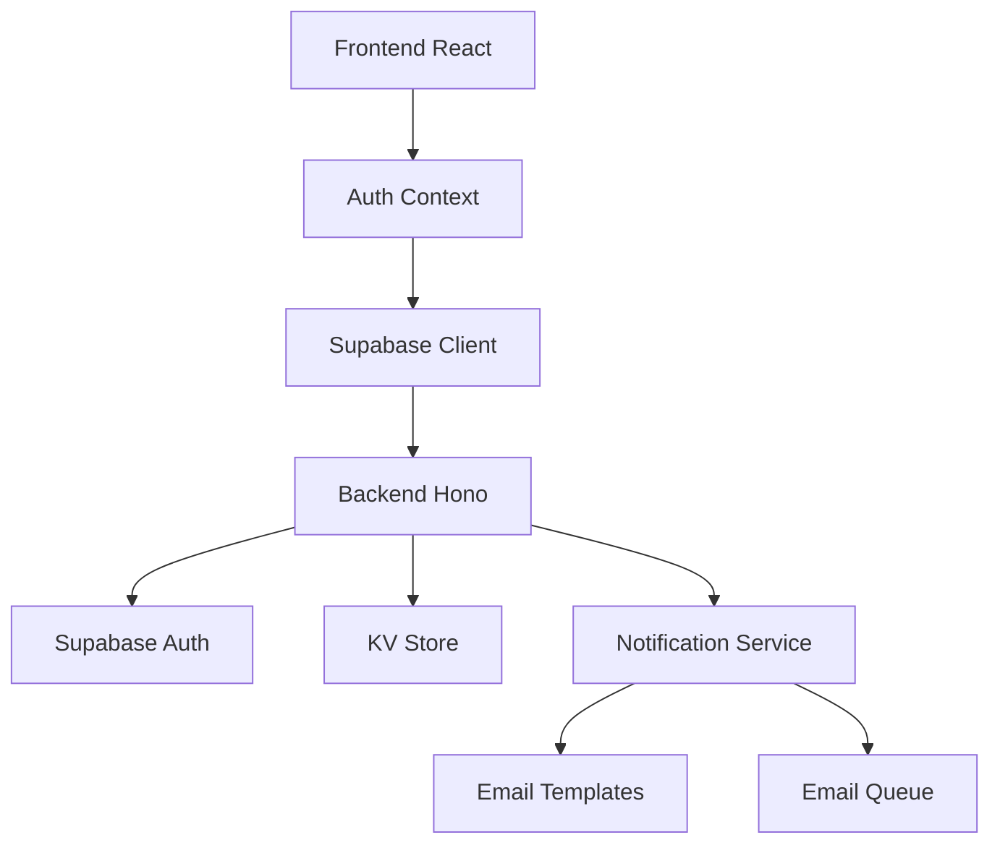

# Sistema de Autenticação e Notificações - Supabase Integration

## 🔐 Autenticação Real com Supabase

### Implementação Completa
- **Backend Integrado**: Servidor Hono com Supabase Auth
- **Três Tipos de Usuário**: Admin, Atendente, Usuário
- **Sessões Persistentes**: Tokens JWT com renovação automática
- **Segurança**: Tokens protegidos, roles baseadas em permissões

### Contas de Demonstração
```
📧 admin@sistema.com     | 🔑 123456 | 👤 Administrador
📧 atendente@sistema.com | 🔑 123456 | 👤 Atendente  
📧 usuario@empresa.com   | 🔑 123456 | 👤 Usuário
```

## 📧 Sistema de Recuperação de Senha

### Funcionalidades
- **Interface Amigável**: Formulário dedicado para reset
- **Validação de Email**: Verificação antes do envio
- **Feedback Visual**: Status de envio e próximos passos
- **Link Temporário**: Tokens com expiração de 1 hora

### Fluxo de Recuperação
1. Usuário clica em "Esqueceu a senha?"
2. Digite email e clique em "Enviar Link de Recuperação"
3. Sistema envia email com link de reset
4. Usuário clica no link e define nova senha
5. Login com nova senha

## 📬 Sistema de Notificações por Email

### Tipos de Notificação

#### 1. Mudança de Status
```typescript
// Disparado quando status de carta/audiência muda
- pendente → aprovado/rejeitado
- Inclui detalhes da solicitação
- Template HTML profissional
```

#### 2. Reunião Agendada
```typescript
// Enviado quando audiência é aprovada
- Link/local da reunião
- Data, hora e duração
- Informações de acesso
```

#### 3. Reset de Senha
```typescript
// Email de recuperação de senha
- Link temporário seguro
- Instruções claras
- Expiração definida
```

### Arquitetura de Notificações

```
Frontend → Backend → KV Store → Email Service
    ↓         ↓         ↓           ↓
   UI    → Endpoint → Storage → Processed
```

## 🚀 Endpoints da API

### Autenticação
```typescript
POST /auth/login          // Login com email/senha
GET  /auth/me            // Validar token atual
POST /auth/logout        // Logout e limpeza
POST /auth/reset-password // Recuperação de senha
POST /auth/create-user   // Criar usuário (admin only)
```

### Notificações
```typescript
POST /notifications/status-change      // Mudança de status
POST /notifications/meeting-scheduled  // Reunião agendada
POST /notifications/send-pending      // Processar pendentes
GET  /notifications/user/:email       // Histórico do usuário
```

## 🔧 Configuração de Desenvolvimento

### Variáveis de Ambiente (Supabase)
```env
SUPABASE_URL=https://xxx.supabase.co
SUPABASE_ANON_KEY=eyJxxx...
SUPABASE_SERVICE_ROLE_KEY=eyJxxx...
FRONTEND_URL=http://localhost:3000
```

### Inicialização Automática
- Usuários demo criados automaticamente
- Perfis salvos no KV Store
- Integração com Supabase Auth

## 🎯 Controle de Permissões

### Matriz de Acesso
| Funcionalidade | Admin | Atendente | Usuário |
|----------------|-------|-----------|---------|
| Dashboard      | ✅     | ✅         | ✅       |
| Criar Cartas   | ❌     | ❌         | ✅       |  
| Criar Audiências | ❌   | ❌         | ✅       |
| Gerenciar Solicitações | ✅ | ✅     | ❌       |
| Agenda         | ✅     | ✅         | ❌       |
| Usuários       | ✅     | ❌         | ❌       |
| Notificações   | ✅     | ✅         | ✅ (próprias) |

## 📱 Central de Notificações

### Funcionalidades
- **Histórico Completo**: Todas as notificações enviadas
- **Filtros por Status**: Pendente, Enviada, Falhou
- **Preview HTML**: Visualização do email completo
- **Estatísticas**: Contadores e métricas
- **Processamento Manual**: Admin pode forçar envio

### Interface
- Cards com estatísticas
- Lista scrollável com detalhes
- Modal para preview completo
- Botão para processar pendentes

## 🔄 Fluxo de Notificação Automática

### Quando uma Solicitação Muda de Status:
1. **Frontend** → Atendente/Admin altera status
2. **Backend** → Recebe request com userEmail
3. **Notification Service** → Cria email HTML
4. **KV Store** → Salva notificação como 'pending'
5. **Email Queue** → Processa emails pendentes
6. **Status Update** → Marca como 'sent'

### Templates Dinâmicos
- **Status Change**: Info da solicitação + novo status
- **Meeting Scheduled**: Detalhes completos da reunião
- **Password Reset**: Link seguro + instruções

## 🧪 Como Testar

### 1. Login
```bash
1. Acesse a aplicação
2. Use uma das contas demo
3. Observe perfil e permissões na sidebar
```

### 2. Mudança de Status (Admin/Atendente)
```bash
1. Vá para "Gerenciar Solicitações"
2. Aprove/rejeite uma solicitação
3. Veja toast confirmando envio de email
4. Acesse "Central de Notificações"
```

### 3. Recuperação de Senha
```bash
1. Na tela de login, clique "Esqueceu a senha?"
2. Digite um email válido
3. Veja confirmação de envio
4. Volte ao login
```

### 4. Central de Notificações
```bash
1. Como Admin: veja todas as notificações
2. Como Usuário: veja apenas suas notificações
3. Clique "Ver Detalhes" para preview completo
4. Use "Processar Notificações Pendentes"
```

## ⚡ Próximas Melhorias

- [ ] Integração com serviço real de email (SendGrid, etc.)
- [ ] Webhooks para eventos em tempo real
- [ ] Templates de email customizáveis
- [ ] Notificações push no navegador
- [ ] Histórico de logins e auditoria
- [ ] 2FA (Two-Factor Authentication)
- [ ] Single Sign-On (Google, Microsoft)
- [ ] Rate limiting para APIs

## 🏗️ Arquitetura Técnica



### Stack Completa
- **Frontend**: React + TypeScript + Tailwind
- **Auth**: Supabase Auth + JWT tokens
- **Backend**: Deno + Hono + TypeScript
- **Storage**: Supabase KV Store
- **Email**: HTML templates + Queue system
- **UI**: Shadcn/ui components
- **Notificações**: Sonner toasts