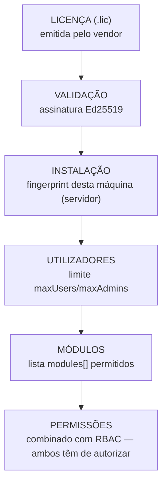

# Licenciamento — Procedimento de Ativação

> Para a implementação técnica, ver [`../developer/licensing.md`](../developer/licensing.md).

## Passo a passo

1. **Instalar o servidor primeiro** (ver [`server-installation.md`](server-installation.md)) —
   a licença liga-se ao fingerprint do servidor, não pode ser feita antes.
2. Iniciar sessão como `admin_sistema` → Definições → Licença.
3. Se este for o primeiro contacto com o vendor: copiar o **fingerprint** mostrado no ecrã
   (`GET /api/v1/license/fingerprint`) e enviá-lo ao vendor.
4. O vendor gera, offline, a licença (`.lic`) e o certificado de ativação (`.cert`) ligado a este
   fingerprint específico (via `license-tools/`, nunca distribuída com o cliente).
5. Carregar ambos os ficheiros no mesmo ecrã (`POST /api/v1/license/activate`).
6. Confirmar que o estado passa a `ACTIVE`.

## Renovação

Repetir o passo 5 com o novo `.lic` — **não é preciso repetir a ativação/fingerprint** se o
`licenseId` se mantiver o mesmo entre renovações (o certificado já ativado continua válido).

## Se o servidor for trocado (nova máquina)

O fingerprint muda — é necessário pedir um novo certificado de ativação ao vendor para o novo
fingerprint. Isto **não** é uma renovação normal.

## Estados possíveis e o que significam para o `admin_sistema`

| Estado | Bloqueia escrita nos módulos? | Ação recomendada |
|---|---|---|
| `ACTIVE` | Não | Nenhuma |
| `EXPIRING` | Não (só aviso) | Contactar o vendor para renovação |
| `PENDING` | Sim | Falta carregar o certificado de ativação |
| `EXPIRED` | Sim | Renovar urgentemente |
| `SUSPENDED` / `REVOKED` | Sim | Contactar o vendor |
| `INVALID` | Sim | Ficheiro adulterado ou fingerprint não corresponde — contactar o vendor, não tentar "corrigir" manualmente |

## Comportamento offline

A validação é sempre feita localmente a partir da licença/certificado já ativados — não depende
de ligação à internet no dia-a-dia. A verificação da CRL (lista de revogação) é opcional e
best-effort (`LICENSE_CRL_URL`) — se ausente ou offline, não afeta o funcionamento normal.
