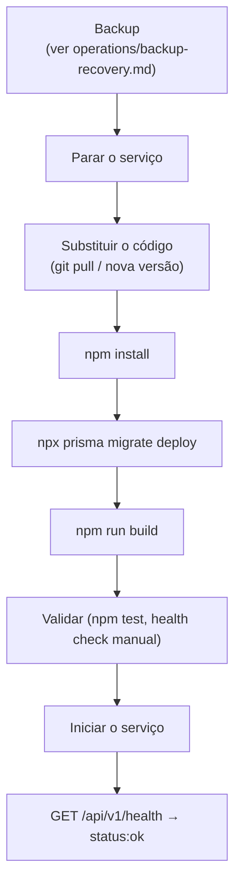
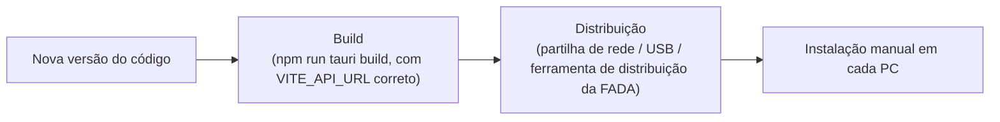

# Atualização do Sistema — SIPAR-FADA

⚠️ **ATUALIZAÇÃO MANUAL** — não existe mecanismo automático nem para o backend nem para o
cliente Tauri nesta versão.

## Backend

Passos:

1. Criar uma cópia de segurança antes de qualquer alteração (ver
   [`../operations/backup-recovery.md`](../operations/backup-recovery.md)).
2. Parar o serviço do backend (ver [`../devops/runbook.md`](../devops/runbook.md)).
3. Substituir o código-fonte pela nova versão.
4. `npm install` (dependências podem ter mudado).
5. `npx prisma migrate deploy` (aplica migrações novas, se existirem).
6. `npm run build`.
7. Validar antes de expor aos utilizadores: `npm test` (server), e um pedido manual a
   `GET /api/v1/health`.
8. Iniciar o serviço.
9. Confirmar o health check com `curl` a partir de um PC cliente real (não só do próprio servidor).

### Rollback

⚠️ NÃO IMPLEMENTADO como procedimento automático. Se a nova versão falhar: restaurar o backup da
base de dados feito no passo 1 (ver [`../operations/backup-recovery.md#restauro`](../operations/backup-recovery.md#restauro))
e reverter o código-fonte para a versão anterior, repetindo os passos 4–9 acima com o código
antigo.

## Cliente (Tauri)

Não há atualização automática — gerar um novo instalador e reinstalar em cada PC de utilizador.
Ver [`client-installation.md`](client-installation.md) e
[`../developer/tauri.md`](../developer/tauri.md) para a limitação de configuração de ligação e o
roteiro (não implementado) de atualização automática via `tauri-plugin-updater`.
