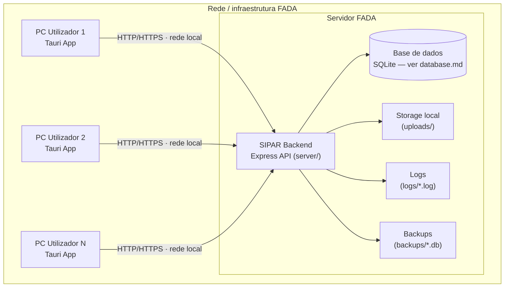
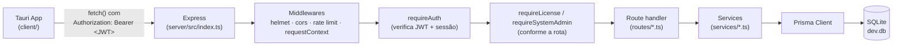
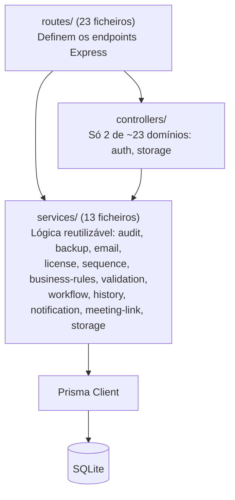

# Arquitetura — SIPAR-FADA

## Topologia de produção real

O sistema é on-premise, dentro da rede/infraestrutura da FADA. **Um servidor central** corre o
backend; **cada PC de utilizador** corre a aplicação desktop (Tauri) e liga-se ao servidor pela
rede local.



Isto **não é uma SaaS multi-tenant na nuvem**: não há partilha de servidor entre clientes
diferentes (ex.: FADA e outra instituição, se o produto for vendido a mais de um cliente, teriam
cada uma o seu próprio servidor central, isolado). Dentro de uma instalação (um cliente), a
topologia é a acima: um servidor, N clientes desktop.

## Fluxo de uma requisição



Não existe uma camada `controllers/` completa e usada por todos os módulos — ver
[`backend.md`](backend.md) para o estado real (só 2 domínios usam `controllers/`, o resto tem a
lógica direto nos ficheiros de rota).

## Comunicação Tauri → API

A app Tauri é, do ponto de vista de rede, um cliente HTTP normal — o wrapper Tauri não intermedeia
a comunicação com o backend, só fornece a janela desktop nativa. Todas as chamadas passam por
`client/src/services/api.ts`, que usa `fetch()` do browser (Tauri corre a UI num WebView) contra
`API_BASE_URL`:

```ts
// client/src/services/api.ts:3
export const API_BASE_URL = import.meta.env.VITE_API_URL || 'http://localhost:5000/api/v1';
```

`VITE_API_URL` é uma variável de **build-time** do Vite — fica compilada dentro do bundle
JavaScript da app no momento em que `npm run tauri build` corre, não é lida em runtime a partir
de um ficheiro de configuração no PC do utilizador. Ver
[`tauri.md`](tauri.md#limitação-atual-endereço-do-servidor-fixo-no-build) para o que isto implica
na prática, e [`../deployment/client-installation.md`](../deployment/client-installation.md)
para o procedimento de instalação.

## Camadas do backend



A maioria dos módulos de negócio (Presentation, Audience, Factura, Fornecedor, Procurement,
Comunicacao, Acta) não passa por um controller dedicado — são geridos por um **motor de CRUD
genérico** parametrizado por configuração (`server/src/utils/module-routes-helper.ts` +
`server/src/routes/modules.routes.ts`). Ver [`backend.md`](backend.md#motor-de-crud-genérico).

## Licenciamento — ligado ao servidor, não a cada PC

O `installationFingerprint` usado pelo licenciamento (`server/src/services/license.service.ts`)
é calculado com `node-machine-id` **na máquina onde o processo Express corre** — ou seja, no
servidor central, não em cada PC Tauri. Uma instalação FADA = um servidor = uma licença. Ver
[`licensing.md`](licensing.md).

## Base de dados — estado atual vs. roteiro

| | Hoje | Roteiro (não implementado) |
|---|---|---|
| Motor | SQLite (`provider = "sqlite"` fixo em `schema.prisma`), ficheiro único `server/prisma/dev.db` no servidor central | PostgreSQL como base principal quando alcançável na rede da FADA |
| Papel do SQLite | Única base de dados | Base **auxiliar/local**, usada quando o PostgreSQL estiver temporariamente inacessível |

O Prisma não troca de provider (`sqlite`/`postgresql`) em runtime a partir do mesmo `schema.prisma`
— os dois motores têm mapeamentos de tipo e sintaxe de migração diferentes. Implementar o roteiro
exige um desenho de datasource dual (dois schemas/clients Prisma, deteção de conectividade no
arranque do servidor, e uma estratégia explícita de sincronização/reconciliação quando o
PostgreSQL volta a ficar disponível depois de correr temporariamente sobre SQLite). ⚠️ Este
desenho ainda não foi feito — é trabalho de arquitetura antes de ser trabalho de implementação.

## Configuração de ligação — implementado

✅ **Resolvido.** O endereço do servidor deixou de ficar só fixo no build. Um ícone de engrenagem
no canto inferior esquerdo do ecrã de login (`client/src/components/auth/login-form.tsx`) abre
`ServerUrlDialog` (`client/src/components/auth/server-url-dialog.tsx`), onde qualquer pessoa —
não só `admin_sistema`, propositadamente: sem conseguir alcançar o servidor certo, ninguém
consegue sequer fazer login — pode substituir o endereço em uso.

Implementação (`client/src/services/api.ts`): `API_BASE_URL` passou de `const` fixo a `let`,
inicializado a partir de `localStorage` (chave `sipar_api_base_url_override`) se existir, caindo
para `VITE_API_URL` (o valor de build) caso contrário. `setApiBaseUrl()`/`resetApiBaseUrl()`
escrevem em `localStorage` e atualizam o valor em memória; o diálogo chama
`window.location.reload()` a seguir a gravar, para que todos os pontos da app que importam
`API_BASE_URL` (dezenas de ficheiros) arranquem já com o valor novo, sem ser preciso tocar em
cada um deles individualmente — os bindings de import do ES modules são sempre lidos ao vivo a
partir do módulo de origem.

Isto **não substitui** a necessidade de gerar o instalador com um `VITE_API_URL` correto da
primeira vez (ver [`tauri.md`](tauri.md)) — é a via de correção depois de distribuído, sem
precisar de reinstalar.

| Peça | Estado |
|---|---|
| Endereço do servidor configurável sem recompilar | ✅ implementado (ícone no login, `localStorage`) |
| Outros segredos (`JWT_SECRET`, etc.) | Continuam só no `.env` do servidor — ver o roteiro do instalador Inno Setup abaixo |

## Empacotamento do servidor — estado atual vs. roteiro

| | Hoje | Roteiro (decidido, não implementado) |
|---|---|---|
| Forma de correr o backend | `node dist/index.js` (via `npm start`, script `prestart` faz o build antes) | Executável Windows autónomo (`.exe`), sem exigir Node.js instalado na máquina do servidor |
| Instalação/configuração inicial | Clonar o repositório, `npm install`, copiar `.env.example` → `.env` e editar à mão (ver [`../deployment/server-installation.md`](../deployment/server-installation.md)) | **Instalador [Inno Setup](https://jrsoftware.org/isinfo.php)** (`.exe` gerado a partir de um script `.iss`) com um ecrã de assistente dedicado que recolhe os valores de `.env` e grava o ficheiro por si |
| Supervisão de processo | Scripts manuais em `server/scripts/` (ver [`../devops/runbook.md`](../devops/runbook.md)) | O próprio instalador Inno Setup regista o serviço do Windows (via NSSM empacotado como recurso do instalador) — os scripts atuais deixam de ser um passo à parte |

**Ferramenta decidida: Inno Setup** — script `.iss` livre, sem custo de licença, com suporte
nativo a páginas de assistente personalizadas via Pascal Script (`[Code]`), o que cobre
exatamente a necessidade do ecrã de configuração sem precisar de WiX/MSI (mais burocrático para
este caso de poucas instalações on-premise).

**Desenho do ecrã de "carregamento do `.env`"** (página de assistente adicional, a seguir à
escolha da pasta de instalação):

1. **Campos pedidos ao técnico** (só os que exigem uma decisão humana, sem valor seguro por
   omissão): porta (`PORT`, pré-preenchida com `5000`), endereço do servidor para
   `CORS_ORIGINS`/`FRONTEND_URL` (campo obrigatório — sem isto o backend recusa arrancar em
   produção, ver [`backend.md`](backend.md)). Restantes variáveis opcionais (SMTP, VAPID,
   integrações de reunião — ver [`configuration-environment.md`](configuration-environment.md))
   ficam de fora do assistente, editáveis manualmente no `.env` gerado depois, se e quando forem
   necessárias.
2. **Segredos nunca pedidos, sempre gerados pelo instalador**: `JWT_SECRET`/`JWT_REFRESH_SECRET`
   — uma função Pascal Script gera bytes aleatórios (`Random`/`GetTickCount` como fonte de
   entropia, convertidos para hex) diretamente no instalador, sem depender de Node.js ou
   `openssl` estarem presentes na máquina (o instalador corre **antes** de o backend/Node estar
   instalado/disponível).
3. **Passo `ssPostInstall`**: o script grava o `.env` na pasta de instalação escolhida, a partir
   de um template embutido no `.iss` (equivalente ao `server/.env.example` atual) com os valores
   recolhidos/gerados substituídos.
4. Só depois disto o instalador regista o serviço do Windows e o arranca — a mesma ordem já
   validada manualmente com `server/scripts/install-windows-service.ps1`, só automatizada.

⚠️ **Decisão de arquitetura e de ferramenta registadas; implementação ainda não iniciada.** Duas
implicações de código a resolver antes/durante a escrita do `.iss` e do build do `.exe`:

- Dentro de um executável empacotado, `__dirname` deixa de apontar para o disco real onde o
  `.exe` está instalado (afeta `config/logger.ts`, `services/backup.service.ts`,
  `services/storage.service.ts`, `routes/system.routes.ts` — todos resolvem caminhos de
  logs/uploads/backups/BD a partir de `__dirname` hoje).
- O motor de query do Prisma (ficheiro `.node` nativo) precisa de configuração explícita na
  ferramenta usada para gerar o `.exe` em si (`pkg`/`@yao-pkg/pkg` ou equivalente — decisão
  distinta da do instalador Inno Setup, que só empacota e distribui o `.exe` já gerado). Ver
  [`../security/security.md`](../security/security.md).
