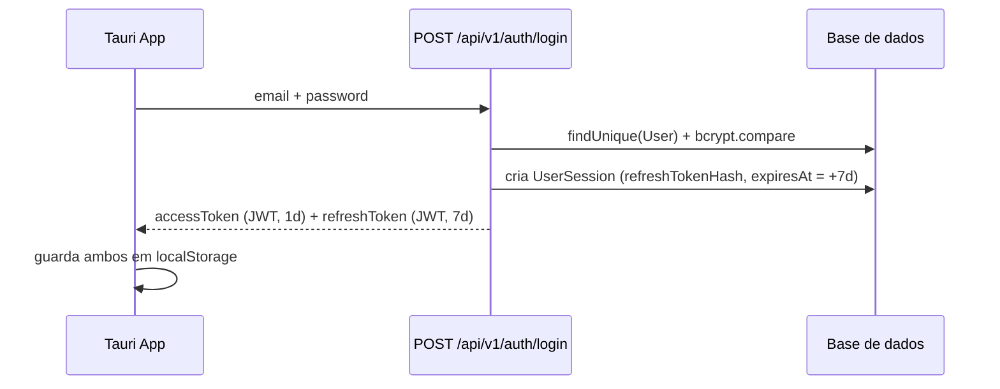

# Autenticação — SIPAR-FADA

## Fluxo de login

- `accessToken`: `jwt.sign({id, email, sid}, JWT_SECRET, {expiresIn: '1d'})`
- `refreshToken`: `jwt.sign({id, email, sid}, JWT_REFRESH_SECRET, {expiresIn: '7d'})`
- `sid` = id da linha `UserSession` criada no login — é isto que torna a sessão revogável (ver
  abaixo). Tokens antigos, emitidos antes de existir `UserSession` (pré-auditoria), não têm `sid`
  e continuam válidos até expirarem naturalmente — não são retroativamente revogáveis.

## Middleware `requireAuth` (`server/src/middlewares/auth.ts`)

Em cada pedido: extrai `Authorization: Bearer <token>` → `jwt.verify` → confirma
`User.status === 'active'` → se o token tiver `sid`, confirma que a `UserSession` existe e não
está revogada (`revokedAt IS NULL`) → popula `req.user`.

## Revogação de sessão e rotação de refresh token

`POST /api/v1/auth/refresh`: valida o `refreshToken`, confirma que o hash bate com
`UserSession.refreshTokenHash`, **gera um refresh token novo e substitui o hash guardado**
(rotação). Se o hash apresentado não bater com o guardado (indício de um refresh token antigo/
roubado a ser reutilizado), a sessão inteira é revogada e o evento
`REFRESH_TOKEN_REUSE_DETECTED` é gravado em `AuditLog`.

`POST /api/v1/auth/logout`: marca `UserSession.revokedAt = now()`.

## Recuperação de password

```mermaid
sequenceDiagram
    participant U as Utilizador
    participant A as Backend
    participant DB as Base de dados

    U->>A: POST /auth/reset-password {email}
    A->>DB: cria PasswordResetToken (hash sha256, TTL 1h)
    A->>U: e-mail com link (FRONTEND_URL + token)
    U->>A: POST /auth/reset-password/confirm {token, novaPassword}
    A->>DB: confirma hash + expiresAt + usedAt IS NULL
    A->>DB: atualiza password, marca usedAt
```

`PasswordResetToken.tokenHash` é `sha256(token)` — o token em claro só existe no e-mail enviado
ao utilizador, nunca fica persistido. Token de uso único (`usedAt`), TTL de 1 hora.

## Perfil de teste vs. produção

`server/prisma/seed.ts` cria ~15 contas de demonstração, incluindo uma conta `admin_sistema`
completa, com passwords fracas em texto simples no código. **Bloqueado por um guard
`NODE_ENV==='production'`** no início de `main()` — mas isto só impede o seed de correr
*automaticamente* em produção; se `db:seed` for corrido manualmente com `NODE_ENV` mal definido,
ainda cria as contas. Ver checklist em
[`../deployment/installation-checklist.md`](../deployment/installation-checklist.md).

## Onde os tokens ficam guardados no cliente

`client/src/components/auth/auth-context.tsx` guarda `accessToken` em `localStorage`. Ver
[`../security/security.md`](../security/security.md) para as implicações (XSS = roubo de sessão
até 7 dias, sem forma de o servidor detetar antecipadamente).
