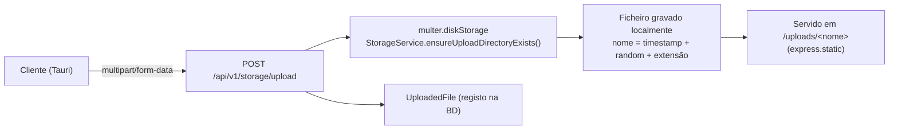

# Armazenamento de Ficheiros — SIPAR-FADA

Upload local em disco (Multer), no servidor central — não há integração com armazenamento em
nuvem (S3, Azure Blob, etc.).

## Fluxo

## Regras aplicadas (`server/src/controllers/storage.controller.ts`)

- **Allowlist de mimetype**: PDF, PNG/JPEG/WEBP/GIF, Word, Excel, CSV. Qualquer outro tipo é
  rejeitado com 400 antes de gravar — inclui HTML/SVG, bloqueando o vetor de hospedar conteúdo
  ativo sob o domínio confiável da app.
- **Limite de tamanho**: 10MB (`multer` `limits.fileSize`). Note-se que
  `license.routes.ts` usa um limite diferente (1MB) para upload de ficheiros de licença — ver
  [`known-issues.md`](../known-issues.md#hc-28).
- **Eliminação exige posse**: `DELETE /storage/delete` só permite apagar um ficheiro se
  `UploadedFile.userId === req.user.id` ou se o utilizador for admin (`admin_sistema` ou
  `isAdminUser()`).
- **`crossOriginResourcePolicy: false`** globalmente em `helmet` (não só no mount `/uploads`) —
  ver [`known-issues.md`](../known-issues.md#sec-14).

## `POST /api/v1/storage/init-buckets`

Nome herdado de uma arquitetura anterior baseada em Supabase (buckets). Hoje só garante que o
diretório local de uploads existe — não cria "buckets" reais.
