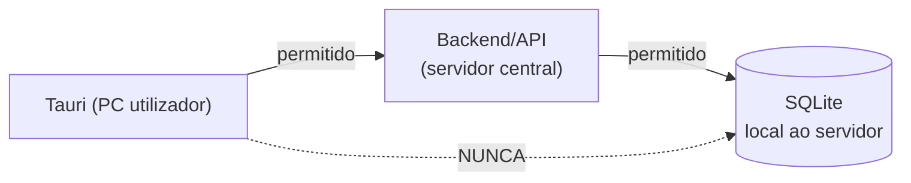

# Rede — SIPAR-FADA

## Fluxo de comunicação obrigatório

Os PCs dos utilizadores **não devem, e hoje não conseguem, aceder diretamente à base de dados**
— o ficheiro SQLite vive no disco do servidor, não é exposto pela rede em nenhuma porta. Todo o
acesso a dados passa obrigatoriamente pela API do backend. (Se o roteiro de PostgreSQL for
implementado no futuro — ver [`../developer/architecture.md`](../developer/architecture.md) —
este princípio tem de se manter: o PostgreSQL, se remoto, nunca deve ficar acessível
diretamente a partir dos PCs cliente, só a partir do servidor de aplicação.)

## Portas e endereços

| | Valor | Fonte |
|---|---|---|
| Porta do backend | `5000` por omissão, configurável via `PORT` no `.env` do servidor | `server/.env.example` |
| IP/hostname do servidor | ⚠️ CONFIGURAÇÃO A DEFINIR PELO FADA | Depende da rede real da instalação |
| DNS interno | ⚠️ CONFIGURAÇÃO A DEFINIR — não confirmado se a FADA usa DNS interno ou IPs fixos | — |

## Firewall

⚠️ CONFIGURAÇÃO A DEFINIR PELO FADA. Regra mínima necessária, inferida do código: a porta do
backend (`PORT`, por omissão 5000) tem de estar acessível, via TCP, a partir de todos os PCs que
correm o SIPAR-FADA Tauri, dentro da rede local. Não há requisito de portas de saída especiais
conhecido no código, além do acesso normal à internet se as integrações opcionais (e-mail,
push, Zoom/Teams/Google Meet, CRL de licenciamento) estiverem configuradas — ver
[`../developer/configuration-environment.md`](../developer/configuration-environment.md).

## CORS

O backend recusa arrancar em produção (`NODE_ENV=production`) se `CORS_ORIGINS` e
`FRONTEND_URL` estiverem ambas vazias — mas isto controla pedidos feitos a partir de um browser
com origem, não a comunicação Tauri→API (a app Tauri não está sujeita à mesma política de
mesma-origem que um site normal). Definir mesmo assim, de forma coerente com o endereço real do
servidor.
